# Solar Potential Intelligence Platform

A production-grade, AI-powered solar intelligence system that analyzes solar radiation from real scientific datasets (NASA POWER, ERA5), estimates photovoltaic energy production, simulates panel orientations, and delivers interactive analysis through the **HoloViz ecosystem**.

Built with **xarray** for multidimensional climate data processing, **pvlib** for physics-accurate solar calculations, and **Panel/Lumen/hvPlot/HoloViews/Datashader/Param** for interactive visualization.

[](https://python.org)
[](LICENSE)
[](#testing)
[](https://panel.holoviz.org)
[](https://docs.astral.sh/ruff/)

### Built With

<p>
  <a href="https://panel.holoviz.org/"></a>&nbsp;&nbsp;
  <a href="https://lumen.holoviz.org/"></a>&nbsp;&nbsp;
  <a href="https://hvplot.holoviz.org/"></a>&nbsp;&nbsp;
  <a href="https://holoviews.org/"></a>&nbsp;&nbsp;
  <a href="https://datashader.org/"></a>&nbsp;&nbsp;
  <a href="https://param.holoviz.org/"></a>
</p>
<p>
  <a href="https://xarray.dev/"></a>&nbsp;&nbsp;&nbsp;
  <a href="https://numpy.org/"></a>&nbsp;&nbsp;&nbsp;
  <a href="https://pandas.pydata.org/"></a>&nbsp;&nbsp;&nbsp;
  <a href="https://www.dask.org/"></a>&nbsp;&nbsp;&nbsp;
  <a href="https://pvlib-python.readthedocs.io/"></a>&nbsp;&nbsp;&nbsp;
  <a href="https://www.python.org/"></a>&nbsp;&nbsp;&nbsp;
  <a href="https://openai.com/"></a>&nbsp;&nbsp;&nbsp;
  <a href="https://power.larc.nasa.gov/"></a>
</p>

---

## Dashboard Preview

### Overview - KPI Cards + Monthly Charts

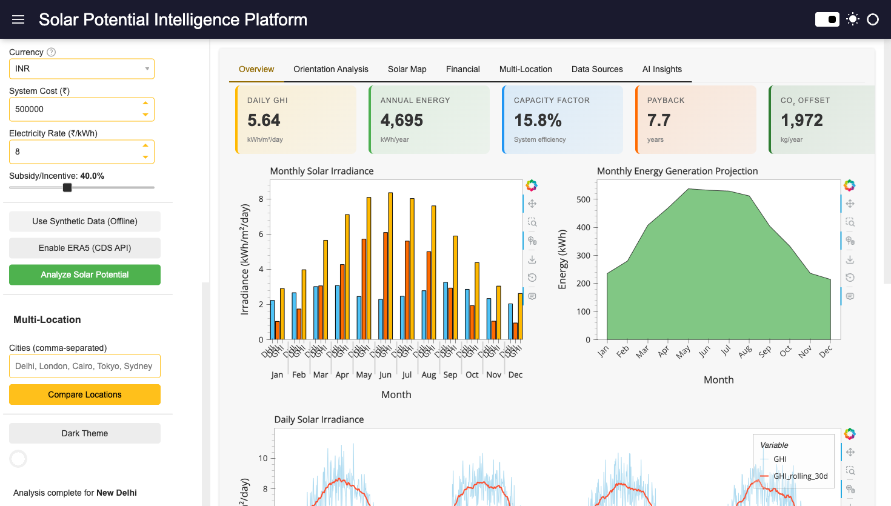

> Real-time KPI cards showing Daily GHI, Annual Energy, Capacity Factor, Payback Period, and CO2 Offset. Monthly Solar Irradiance bar chart (GHI/DNI/DHI breakdown) and Energy Generation Projection area chart.

### Overview - Daily Timeseries + Distribution + Seasonal Heatmap

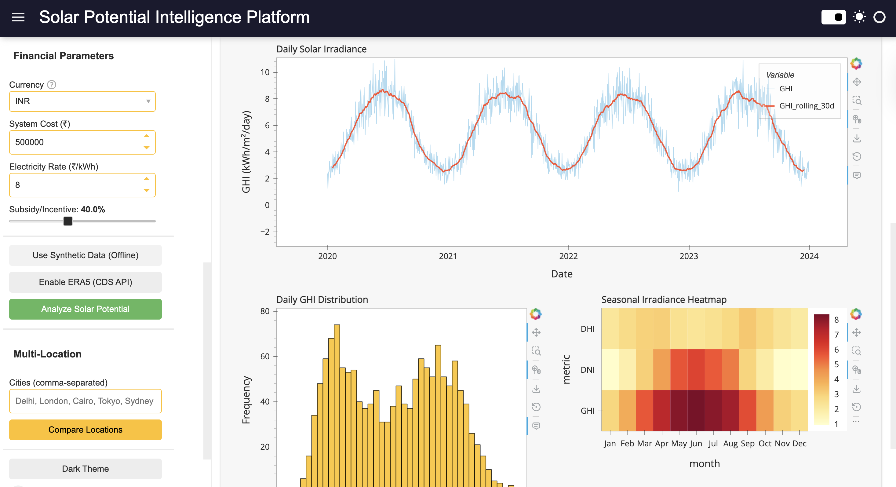

> Daily solar irradiance timeseries with 30-day rolling average, GHI frequency distribution histogram, and seasonal irradiance heatmap (month x metric).

---

### Orientation Analysis - Find the Optimal Panel Setup

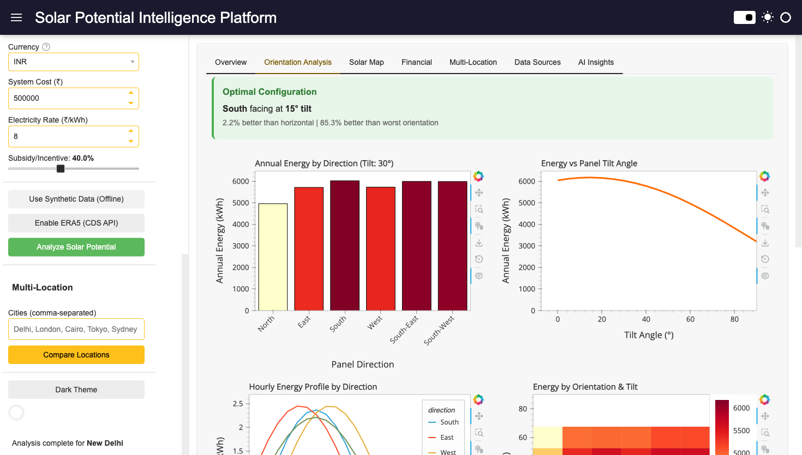

> Optimal configuration banner (South-facing at 15 degrees tilt), Annual Energy by Direction comparison, Energy vs Tilt Angle curve, Hourly Energy Profile by Direction, and Energy by Orientation & Tilt heatmap.

---

### Interactive Solar Map - Click to Simulate Anywhere

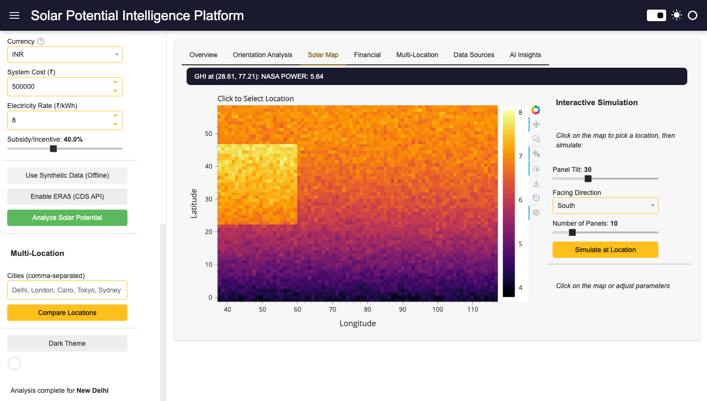

> Global solar radiation heatmap rendered with Datashader. Click any point on the map, adjust tilt/direction/panels, and run instant simulations.

### Map Simulation Results

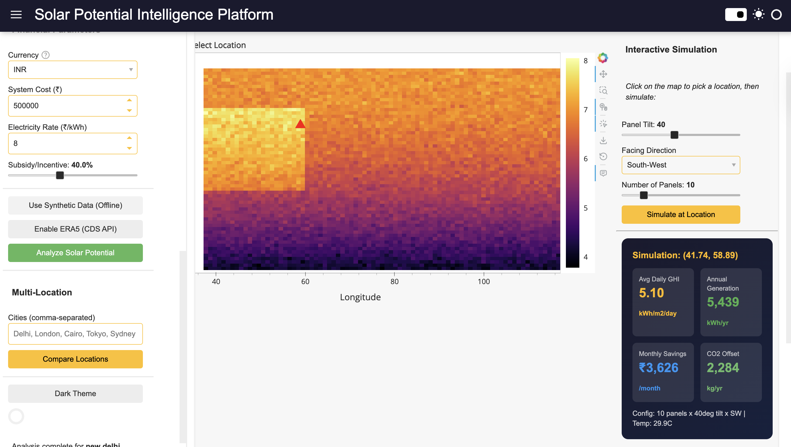

> After clicking a location on the map, the simulation panel shows: Average Daily GHI, Annual Generation (kWh/year), Monthly Savings, CO2 Offset, and system configuration details.

---

### Financial Analysis - Investment Returns in Your Currency

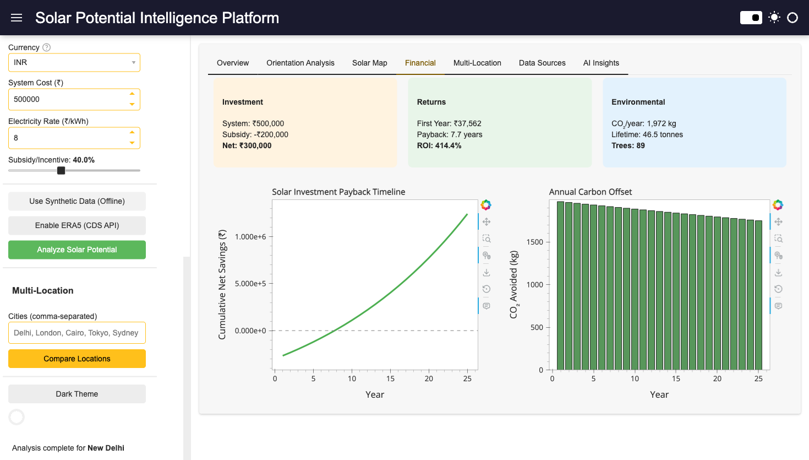

> Multi-currency support (INR, USD, EUR, GBP) with automatic defaults. Investment breakdown, Returns summary (first-year savings, payback period, ROI), Environmental impact (CO2 offset, equivalent trees). Solar Investment Payback Timeline and Annual Carbon Offset charts.

---

### Multi-Location Comparison - Rank Cities by Solar Potential

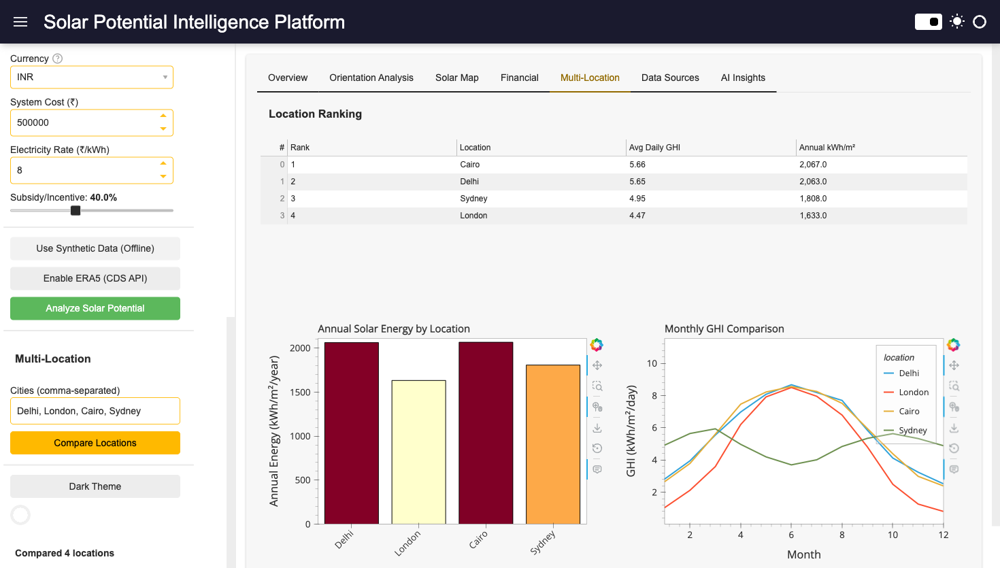

> Compare up to 10 cities side-by-side. Ranking table sorted by solar resource quality. Annual Solar Energy bar chart and Monthly GHI Comparison timeseries overlay.

---

### Dual-Source Cross-Validation - NASA POWER vs ERA5

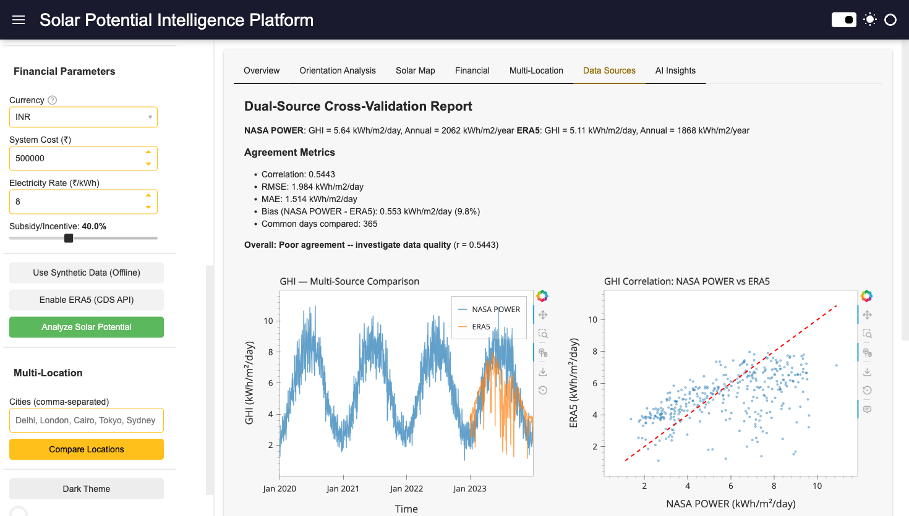

> When ERA5 (Copernicus CDS) is enabled, the Data Sources tab shows a full cross-validation report: correlation, RMSE, MAE, bias metrics. GHI timeseries overlay and NASA POWER vs ERA5 scatter plot with 1:1 reference line.

---

### AI-Powered Insights - Natural Language Analysis

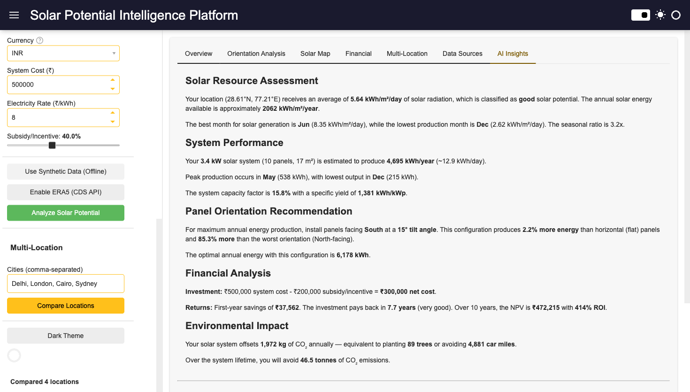

> Template-based analysis report (works without API key) covering Solar Resource Assessment, System Performance, Panel Orientation Recommendation, Financial Analysis, and Environmental Impact. All values use your actual analysis data.

### AI Chat - Ask Anything About Your Solar Setup

| Question | Screenshot |
|----------|-----------|
| "What's the best time to use heavy appliances?" | 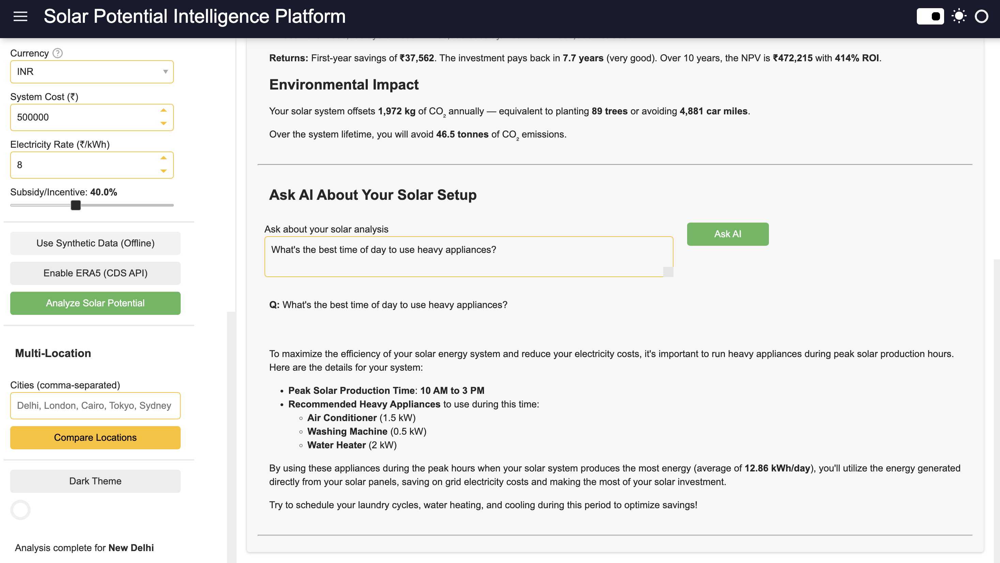 |
| "What if electricity rates increase to 12 rupees/kWh?" | 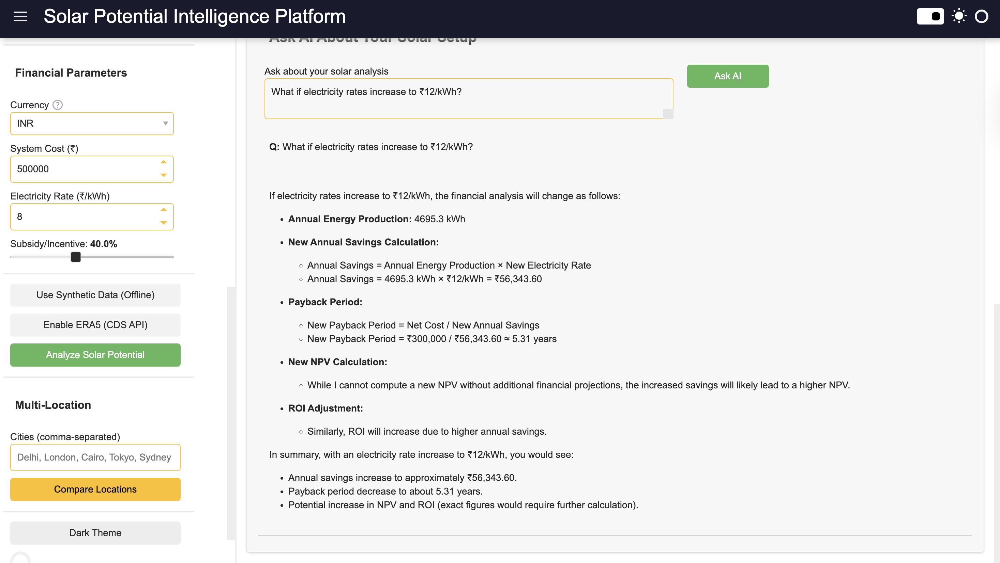 |
| "Should I add a battery storage system?" | 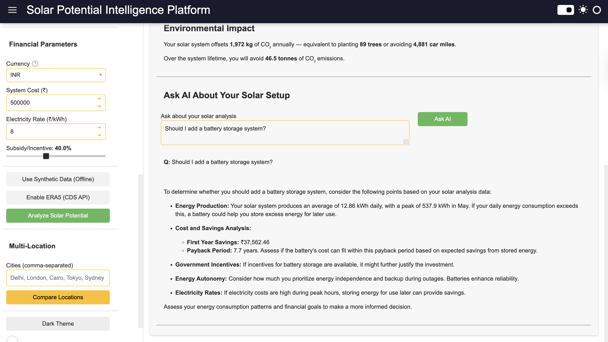 |
| "How does my carbon offset compare to driving an EV?" | 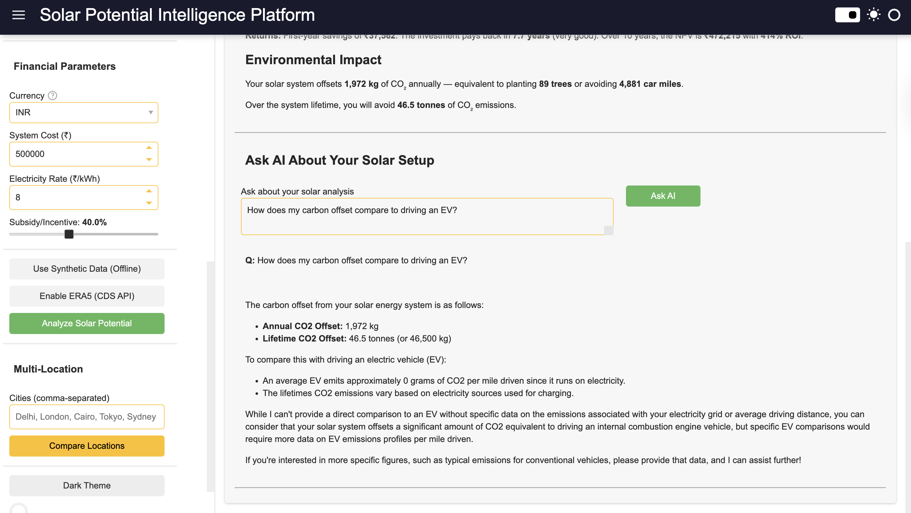 |

> GPT-4o-mini powered chat that uses your actual system data (production, costs, savings) to give specific, actionable answers.

---

### Dark Theme

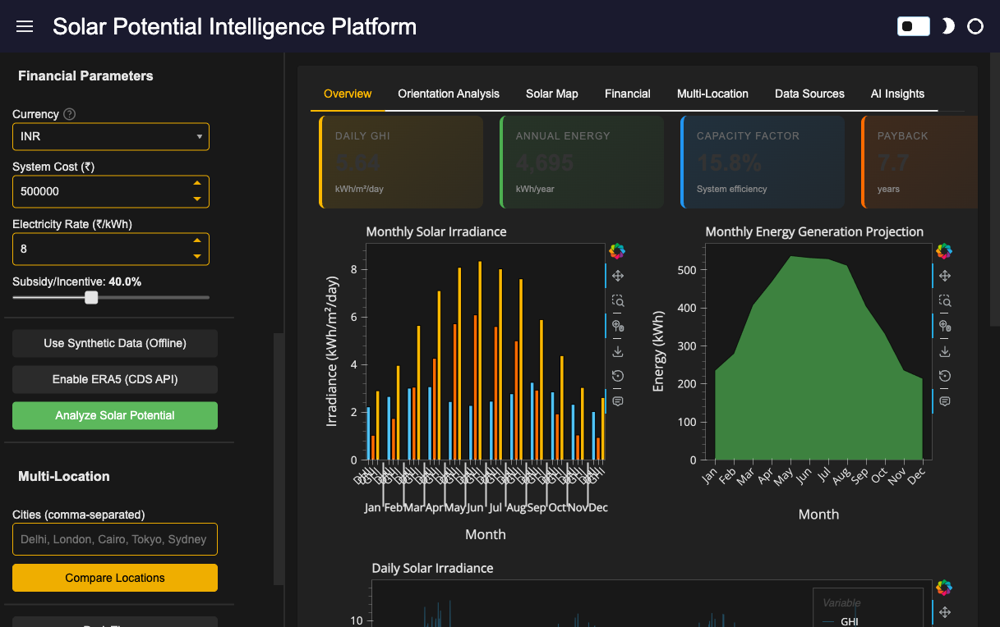

> Full dark theme support with one click. All charts, KPI cards, and UI elements adapt automatically.

---

## Architecture

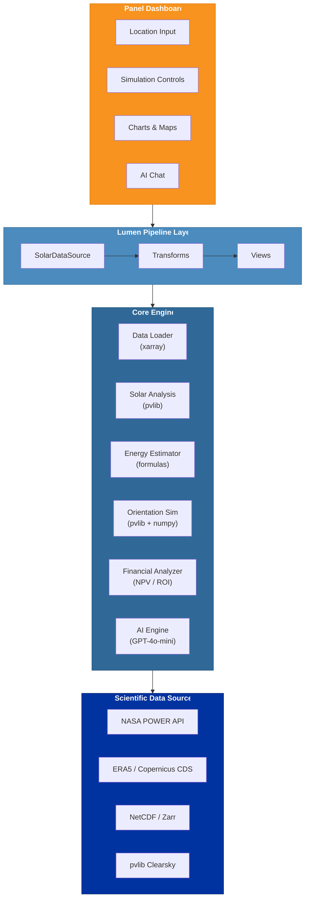

## Features

### Core Scientific Analysis
- **Solar radiation analysis** using xarray `.groupby()`, `.resample()`, `.rolling()` operations
- **Energy estimation** with temperature derating (NOCT model), inverter losses, panel degradation
- **Orientation simulation** with full direction x tilt matrix using pvlib transposition models
- **Financial modeling** with payback period, NPV, ROI, carbon offset, lifetime projections
- **Dual-source validation** comparing NASA POWER vs ERA5 reanalysis data

### Interactive Dashboard (7 Tabs)
- **Overview** - KPI cards, monthly irradiance, energy projection, daily timeseries, distribution, heatmap
- **Orientation Analysis** - Direction comparison, tilt curve, hourly profiles, orientation heatmap
- **Solar Map** - Datashader-rendered global radiation map with click-to-simulate
- **Financial** - Investment/returns/environmental summary, payback timeline, carbon offset chart
- **Multi-Location** - Compare up to 10 cities with ranking table and comparison charts
- **Data Sources** - NASA POWER vs ERA5 cross-validation with correlation analysis
- **AI Insights** - Template-based report + GPT-4o-mini powered Q&A chat

### Multi-Currency Support
- **INR** (Indian Rupee) - Default: 5,00,000 system cost, 8 rupees/kWh, 40% subsidy
- **USD** (US Dollar) - Default: $15,000 system cost, $0.12/kWh, 30% ITC
- **EUR** (Euro) - Default: 12,000 euros, 0.25 euros/kWh, 25% subsidy
- **GBP** (British Pound) - Default: 8,000 pounds, 0.28 pounds/kWh, 0% subsidy

### HoloViz Ecosystem Usage
| Library | Usage |
|---------|-------|
| **Panel** | Dashboard framework, widgets, layout, FastListTemplate, reactive callbacks |
| **Lumen** | Custom `SolarDataSource`, `SolarEnergyTransform`, pipeline integration |
| **hvPlot** | All chart generation (`.hvplot.bar()`, `.hvplot.line()`, `.hvplot.area()`, `.hvplot.hist()`) |
| **HoloViews** | `hv.HeatMap`, `hv.Image`, `hv.Table`, `hv.Points`, overlays, streams |
| **Datashader** | Server-side rendering for global solar radiation maps |
| **Param** | All classes use `param.Parameterized` for typed configuration |

---

## Quick Start

### Installation

```bash
git clone https://github.com/ghostiee-11/solar-intelligence.git
cd solar-intelligence
pip install -e .
```

### Optional Dependencies

```bash
# AI chat (GPT-4o-mini)
pip install -e ".[ai]"
export OPENAI_API_KEY="your-key-here"

# ERA5 data (Copernicus CDS)
pip install -e ".[era5]"
# Create ~/.cdsapirc with your CDS credentials

# All extras
pip install -e ".[all]"
```

### Run the Dashboard

```bash
panel serve src/solar_intelligence/ui/panel_dashboard.py --show
```

Then:
1. Enter a city name or coordinates
2. Adjust panel configuration (efficiency, area, number of panels)
3. Click **"Analyze Solar Potential"**
4. Explore all 7 tabs

### Python API

```python
from solar_intelligence.data_loader import generate_synthetic_solar_data
from solar_intelligence.solar_analysis import SolarAnalyzer
from solar_intelligence.energy_estimator import EnergyEstimator
from solar_intelligence.financial import FinancialAnalyzer

# Load data for New Delhi
ds = generate_synthetic_solar_data(lat=28.6, lon=77.2)

# Solar analysis
analyzer = SolarAnalyzer(dataset=ds, latitude=28.6, longitude=77.2)
summary = analyzer.summary()
print(f"Average GHI: {summary['average_daily_ghi']:.2f} kWh/m2/day")
print(f"Best month: {summary['best_month']} ({summary['best_month_ghi']:.1f} kWh/m2/day)")

# Energy estimation (20 panels, 1.7m2 each, 20% efficiency)
estimator = EnergyEstimator(panel_efficiency=0.20, panel_area=1.7, num_panels=20)
energy = estimator.system_summary(ds)
print(f"Annual production: {energy['production']['annual_energy_kwh']:,.0f} kWh")
print(f"Capacity factor: {energy['performance']['capacity_factor_pct']:.1f}%")

# Financial analysis (INR)
fa = FinancialAnalyzer(system_cost=500000, electricity_rate=8, incentive_percent=0.40)
fin = fa.financial_summary(energy['production']['annual_energy_kwh'])
print(f"Payback: {fin['returns']['payback_years']:.1f} years")
print(f"ROI: {fin['returns']['roi_pct']:.0f}%")
```

### Orientation Simulation

```python
from solar_intelligence.orientation_simulator import OrientationSimulator

sim = OrientationSimulator(latitude=28.6, longitude=77.2)
optimal = sim.optimal_orientation(ghi_daily_array, year=2023)
print(f"Best: {optimal['best_direction']} at {optimal['best_tilt']} degrees tilt")
print(f"Gain vs horizontal: {optimal['energy_gain_vs_horizontal_pct']:.1f}%")
```

---

## Project Structure

```
solar-intelligence/
|-- src/solar_intelligence/
|   |-- __init__.py
|   |-- config.py                 # Constants, API config, currency defaults
|   |-- data_loader.py            # NASA POWER + ERA5 clients, geocoding, caching
|   |-- solar_analysis.py         # Irradiance stats, seasonal patterns, multi-location
|   |-- energy_estimator.py       # PV energy output with temperature derating
|   |-- orientation_simulator.py  # Tilt/azimuth simulation (pvlib transposition)
|   |-- visualization.py          # hvPlot/HoloViews chart generators (20+ charts)
|   |-- financial.py              # ROI, NPV, payback, carbon offset, lifetime savings
|   |-- ai_engine.py              # Template + LLM-powered insights and chat
|   +-- ui/
|       |-- panel_dashboard.py    # Main Panel dashboard (7 tabs, 900+ lines)
|       |-- lumen_app.py          # Lumen pipeline interface
|       +-- components.py         # Reusable UI widgets
|-- tests/
|   |-- conftest.py               # Shared fixtures (3 location datasets)
|   |-- test_data_loader.py       # Data loading, caching, geocoding
|   |-- test_solar_analysis.py    # Irradiance stats validation
|   |-- test_energy_estimator.py  # Energy formula correctness
|   |-- test_orientation_simulator.py  # Physics constraints (S > N in NH)
|   |-- test_financial.py         # Payback, NPV, carbon calculations
|   |-- test_visualization.py     # Chart rendering validation
|   |-- test_integration.py       # End-to-end pipeline tests
|   |-- test_dual_source.py       # NASA POWER vs ERA5 cross-validation
|   +-- ...                       # 300+ tests total
|-- examples/quickstart.py
|-- notebooks/                    # Jupyter exploration notebooks
|-- screenshots/                  # Dashboard screenshots
|-- pyproject.toml                # Modern Python packaging
|-- requirements.txt
+-- LICENSE                       # MIT
```

## Data Sources

| Source | Coverage | Resolution | Access |
|--------|----------|------------|--------|
| [NASA POWER](https://power.larc.nasa.gov/) | Global, 1981-present | 1 degree x 1 degree, daily | Free API, no key needed |
| [ERA5 (Copernicus)](https://cds.climate.copernicus.eu/) | Global, 1940-present | 0.25 degree x 0.25 degree, hourly | Free account + API key |
| Synthetic Generator | Any location | Daily | Built-in, offline |

## Technology Stack

| Category | Libraries |
|----------|-----------|
| **Scientific Computing** | xarray, numpy, pandas, pvlib, dask |
| **Visualization** | Panel, hvPlot, HoloViews, Datashader, Param, Lumen |
| **Climate Data** | NetCDF4, h5netcdf, zarr, cdsapi |
| **Geocoding** | geopy |
| **AI/LLM** | OpenAI (GPT-4o-mini) |
| **Testing** | pytest (300+ tests) |

## Testing

```bash
# Run all tests
pytest tests/ -v

# With coverage
pytest tests/ -v --cov=solar_intelligence

# Quick run
pytest tests/ -x -q
```

**Test results:** 300 passed, 1 skipped (live API test) in ~50 seconds.

Tests cover:
- Unit tests for all 8 modules
- Integration tests (full pipeline: data -> analysis -> energy -> orientation -> financial -> AI)
- Multi-location comparison (Delhi, London, Cairo, Sydney)
- Southern hemisphere validation (Sydney: North-facing optimal)
- Dashboard smoke tests
- Dual-source cross-validation tests
- Lumen pipeline integration tests

## Development

```bash
# Install with dev dependencies
pip install -e ".[dev]"

# Run tests
pytest tests/ -v --cov=solar_intelligence

# Lint
ruff check src/

# Run dashboard with auto-reload
panel serve src/solar_intelligence/ui/panel_dashboard.py --show --autoreload
```

## License

MIT License. See [LICENSE](LICENSE) for details.

---
